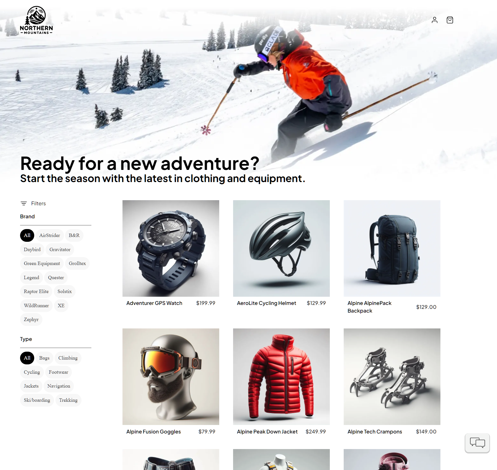

# 🛍️ eShop Reference App – "AdventureWorks"

_Author: Reginald Ozougwu_

Welcome to **AdventureWorks**, a reference implementation of a cloud-native e-commerce web application built using **.NET Aspire**. This project showcases a modern service-based architecture with components like product catalog, shopping cart, ordering system, and more — designed to run efficiently in development and production environments.




---

## 🚀 Getting Started

This version of eShop is built on **.NET 9**. Use the instructions below to set up and run the application based on your environment.

---

## 🧰 Prerequisites

### Required Tools

- ✅ [Docker Desktop](https://docs.docker.com/engine/install/) (must be installed and running)
- ✅ [.NET 9 SDK](https://dot.net/download?cid=eshop)

---

## 🖥️ Windows (Visual Studio)

Install [Visual Studio 2022 v17.10+](https://visualstudio.microsoft.com/vs/) with the following workloads:

- `ASP.NET and web development`
- `.NET Aspire SDK` (under *Individual Components*)
- (Optional) `.NET MAUI` workload for running client apps

### Or Use the Automated Script

> Open PowerShell or Terminal **as Administrator**

```powershell
Install-Module -Name Microsoft.WinGet.Configuration -AllowPrerelease -AcceptLicense -Force
$env:Path = [System.Environment]::GetEnvironmentVariable("Path","Machine") + ";" + [System.Environment]::GetEnvironmentVariable("Path","User")
Get-WinGetConfiguration -File .\.configurations\vside.dsc.yaml | Invoke-WinGetConfiguration -AcceptConfigurationAgreements
